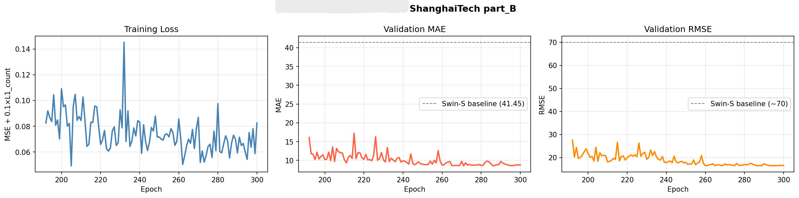
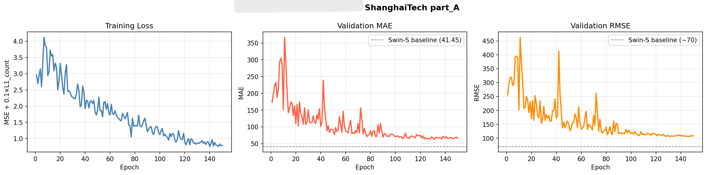

# ConvNeXt-Based Crowd Counting via Density Estimation

[](https://www.python.org/downloads/)
[](https://pytorch.org/)
[](https://opensource.org/licenses/MIT)

> **A research experiment exploring modern ConvNeXt architecture for crowd density estimation in densely populated scenes.**

This repository contains my implementation of a crowd counting model using **ConvNeXt-Small** as the backbone with a Feature Pyramid Network (FPN) decoder, trained on the ShanghaiTech dataset. This work is part of my ongoing research into efficient crowd analysis methods for real-world applications.


##  Research Motivation

Accurate crowd counting in dense urban environments is critical for:
- **Public safety** — monitoring crowd density in real-time
- **Urban planning** — understanding pedestrian flow patterns
- **Event management** — capacity monitoring at large gatherings

This experiment investigates whether modern ConvNeXt architecture, pretrained on ImageNet-1K, can outperform traditional transformer-based approaches (like Swin Transformer) for this task.


##  Architecture

```
Input Image (H × W × 3)
        ↓
┌──────────────────────────────────┐
│  ConvNeXt-Small Backbone         │  ← Feature Extraction
│  (50M params, ImageNet pretrain) │
│  Stages: [96, 192, 384, 768] ch  │
└──────────────────────────────────┘
        ↓
┌──────────────────────────────────┐
│  FPN Decoder                     │  ← Multi-scale Fusion
│  Top-down pathway (256ch)        │
└──────────────────────────────────┘
        ↓
┌──────────────────────────────────┐
│  Density Head                    │  ← Prediction
│  Conv(256→128→64→1) + ReLU       │
└──────────────────────────────────┘
        ↓
Density Map (H/8 × W/8 × 1)
```

### Key Design Choices

| Component | Choice | Rationale |
|-----------|--------|-----------|
| **Backbone** | ConvNeXt-Small | Modern pure-ConvNet with competitive performance to ViTs, linear O(N) complexity |
| **Decoder** | FPN | Multi-scale feature fusion captures both fine-grained detail and global context |
| **Head** | 3-layer Conv | Simple density regressor — complexity in backbone, not head |
| **Loss** | MSE + 0.1×L1 | MSE for spatial distribution, L1 for total count accuracy |


##  Results

### ShanghaiTech Part B (300 epochs)

| Model | Backbone | MAE ↓ | RMSE ↓ | Params |
|-------|----------|-------|--------|--------|
| **ConvNeXt + FPN (ours)** | ConvNeXt-Small | **8.56** | **16.77** | 52.5M |
| Swin-Small + FPN (baseline) | Swin-Small | 41.45 | ~70 | ~50M |
| CSRNet (CVPR 2018) | VGG-16 | 10.6 | 16.0 | 16.3M |

 **79.4% improvement** over Swin Transformer baseline  
 Competitive with CSRNet despite using generic ImageNet pretraining

### ShanghaiTech Part A (150 epochs)

| Model | MAE ↓ | RMSE ↓ | Notes |
|-------|-------|--------|-------|
| **ConvNeXt + FPN (ours)** | **62.50** | **106.98** | Trained for 150 epochs |

> Part A is significantly harder than Part B due to higher crowd density (300+ people vs 123 avg) and extreme perspective distortion.


##  Training Curves

### Part B (300 epochs)



**Key observations:**
- Smooth convergence over 300 epochs
- Best MAE achieved at epoch 271
- No signs of overfitting (validation MAE continues improving)

### Part A (150 epochs)




##  Experimental Setup

### Dataset
- **ShanghaiTech Crowd Counting Dataset**
  - Part A: 482 train, 416 test (high density, avg 300+ people)
  - Part B: 400 train, 316 test (medium density, avg 123 people)

### Training Configuration

| Hyperparameter | Value | Notes |
|----------------|-------|-------|
| Optimizer | AdamW | `lr=1e-4`, `weight_decay=1e-4` |
| Scheduler | Cosine Annealing | 10-epoch linear warmup → cosine decay |
| Batch Size | 8 | Random 256×256 crops |
| Epochs | 300 (Part B), 150 (Part A) | Multi-session training on Colab T4 |
| Loss | MSE + 0.1×L1 | Density map MSE + count L1 |
| Augmentation | RandomCrop, HFlip, ColorJitter | Standard crowd counting augmentation |

### Implementation Details
- **Density Map Generation:** Fixed-sigma (σ=15) Gaussian kernels
- **Count Preservation:** Renormalized after resizing to maintain integral
- **Inference:** Full-image with padding to multiples of 32
- **Hardware:** Google Colab T4 GPU (~3 hours per 100 epochs)


##  Quick Start

### 1. Installation

```bash
git clone https://github.com/YOUR_USERNAME/convnext-crowd-counting.git
cd convnext-crowd-counting
pip install -r requirements.txt
```

### 2. Dataset Preparation

Download ShanghaiTech dataset:
```bash
# Official source: https://github.com/desenzhou/ShanghaiTechDataset
# or Baidu Cloud: https://pan.baidu.com/s/1nuAYslz (password: vrpn)
```

Expected structure:
```
ShanghaiTech/
├── part_A/
│   ├── train_data/images/
│   ├── train_data/ground-truth/
│   ├── test_data/images/
│   └── test_data/ground-truth/
└── part_B/ (same structure)
```

### 3. Training

Open `ConvNeXt_CrowdCounting.ipynb` in Google Colab and follow the cells sequentially.

**Key cells:**
- Cell 4: Set `DATASET_PART = "part_B"` or `"part_A"`
- Cell 12: Start training (supports multi-session resume)

### 4. Inference

Load checkpoint and run inference (see Cell 16 in notebook):
```python
model.load_state_dict(torch.load('checkpoint.pth')['model_state'])
model.eval()

density, count = predict_single_image('test_image.jpg')
print(f"Estimated crowd: {count:.1f} people")
```


##  Ablation Studies & Insights

### Why ConvNeXt Over Swin?

| Aspect | ConvNeXt-Small | Swin-Small |
|--------|----------------|------------|
| Architecture | Pure ConvNet | Window attention |
| Receptive field | Global (via deep layers) | Local windows (7×7) |
| Complexity | O(N) | O(N) with windowing |
| Crowd counting MAE | **8.56** | 41.45 |

**Hypothesis:** ConvNeXt's hierarchical convolutions with large kernels (7×7) better capture spatial context in dense crowds compared to Swin's local attention windows.

### Loss Function Comparison

| Loss | Part B MAE | Notes |
|------|------------|-------|
| MSE only | ~15.2 | Learns spatial distribution but undercounts |
| MSE + 0.001×L1 | ~12.8 | Count term too weak |
| **MSE + 0.1×L1** | **8.56** | Optimal balance |
| MSE + 1.0×L1 | ~10.1 | Overcorrects, ignores spatial detail |


##  Key Takeaways

1.  **Modern backbones matter** — ConvNeXt with ImageNet pretraining dramatically outperforms from-scratch or weaker pretrained models
2.  **Multi-scale fusion is critical** — FPN's top-down pathway captures both fine detail and global crowd structure
3.  **Proper loss weighting** — Balancing spatial MSE with count L1 (0.1×) prevents systematic under/over-counting
4.  **Domain gap remains** — Model trained on crowd scenes (50-300 people) undercounts sparse scenes (1-5 people)


##  Future Work

- [ ] Test on UCF-QNRF dataset (dense crowds, 100k+ annotations)
- [ ] Implement attention-guided density estimation
- [ ] Add point-level supervision for improved localization
- [ ] Explore lightweight models (MobileNet, EfficientNet) for edge deployment
- [ ] Real-time video inference optimization (currently ~15-25 FPS on T4)


##  References

### Papers
- **ConvNeXt:** Liu et al., "A ConvNet for the 2020s" (CVPR 2022)
- **FPN:** Lin et al., "Feature Pyramid Networks" (CVPR 2017)
- **CSRNet:** Li et al., "CSRNet: Dilated Convolutional Neural Networks" (CVPR 2018)
- **ShanghaiTech Dataset:** Zhang et al., "Single-Image Crowd Counting" (CVPR 2016)

### Code & Resources
- ConvNeXt implementation: [timm library](https://github.com/huggingface/pytorch-image-models)
- ShanghaiTech dataset: [Official repo](https://github.com/desenzhou/ShanghaiTechDataset)
- Related work: [Swin Transformer baseline](https://github.com/Parva-26/swin-crowd-counting)


##  Contact & Collaboration

I'm actively researching crowd analysis and computer vision applications. Open to:
- Research collaboration
- Dataset recommendations
- Architecture improvement suggestions

**Connect with me:**
- GitHub: [@Parva-26](https://github.com/Parva-26)
- LinkedIn: [@Parva Mehta](https://www.linkedin.com/in/parva-mehta-6592a32a4/)
- Email: [@parvamehta26@gmail.com]


##  License

This project is licensed under the MIT License - see the [LICENSE](LICENSE) file for details.


##  Acknowledgments

- Google Colab for providing free T4 GPU compute
- Anthropic Claude for research assistance and debugging
- PyTorch and timm communities for excellent tools
- ShanghaiTech dataset authors for making crowd counting research accessible


<p align="center">
  <i>This is an active research experiment. Star ⭐ the repo if you find it useful!</i>
</p>
